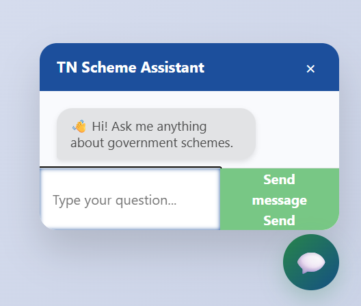

# Smart Scheme Recommender for Every Citizen

> A citizen-centric web application to recommend suitable government schemes based on personal eligibility.

---

## 📖 Overview

**Smart Scheme Recommender for Every Citizen** is a government scheme recommendation system designed to simplify the process of discovering and applying for welfare schemes. By analyzing user input (like age, income, education, etc.), the system filters and suggests the most relevant schemes from a preloaded database. The portal supports Tamil language interaction, real-time chatbot communication, and document scanning for accessibility.

---

## 💡 Key Features

- ✅ Personalized government scheme recommendations
- 🗂 Supports PDF, DOCX, image, and CSV document uploads
- 📄 Optical Character Recognition (OCR) to extract text
- 🌐 Tamil translation and speech synthesis for accessibility
- 💬 Real-time chatbot with simple query-response interaction
- 🧠 Grammar correction and text summarization
- 🧾 Feedback mechanism for user suggestions

---

## 🛠️ Tech Stack

| Layer        | Technologies Used                                                                 |
|--------------|------------------------------------------------------------------------------------|
| **Frontend** | HTML, CSS, JavaScript, Bootstrap                                                  |
| **Backend**  | Python (Flask)                                                                    |
| **Libraries**| gTTS, PyPDF2, EasyOCR, Tesseract, pdf2image, Transformers (mBART, T5), OpenCV     |
| **Language Support** | English, Tamil (via translation + gTTS)                                  |

---

## 🧑‍💻 Team Members

| Name              | Role                                         |
|-------------------|----------------------------------------------|
| **Manikandan M**      | Backend Developer, Frontend Integrator       |
| **Mega Sheyam S**     | ML Model Integration, Data Preprocessing     |
| **Kevin T**           | UI/UX Design, HTML + JS + Bootstrap Layout  |
| **Karuppusamy S**     | Scheme Research & Mapping Expert            |

---

## 📁 Project Directory Structure

Smart-Scheme-Recommender/
│
├── app.py # Main Flask application
├── templates/ # HTML pages
├── static/ # Static assets (CSS, JS, images)
│ ├── assets/
│ └── style.css
├── uploads/ # Uploaded PDF/DOCX/Image files
├── audio/ # Audio output from gTTS
├── requirements.txt # Python dependencies
└── README.md # Project documentation

## 📷 Screenshots

> Below are some key pages from the Smart Scheme Recommender platform:

### 🏠 Home Page

---

### 📝 Form Page

---

### 🎯 Scheme Recommender Page

---

### 💬 Chatbot Interface

---

### 🗣 Translator Page

---

### 🚨 Raise Complaint Page

